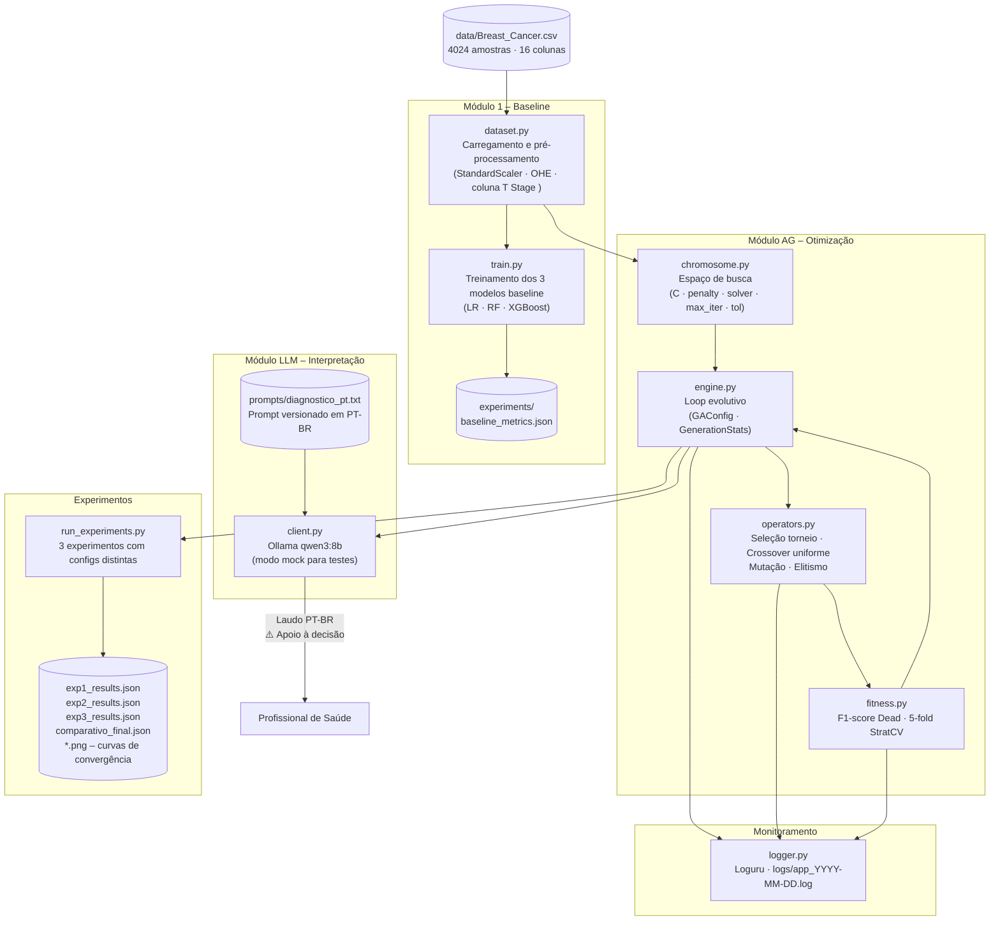
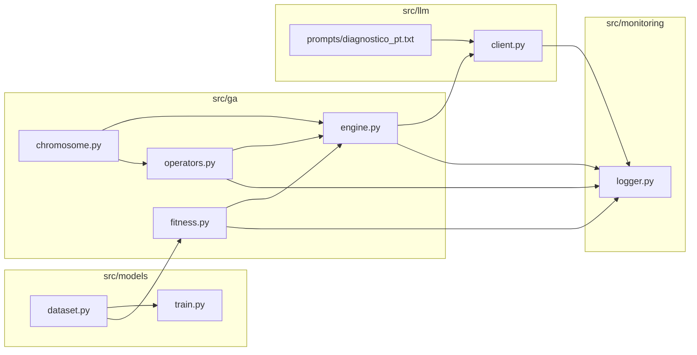
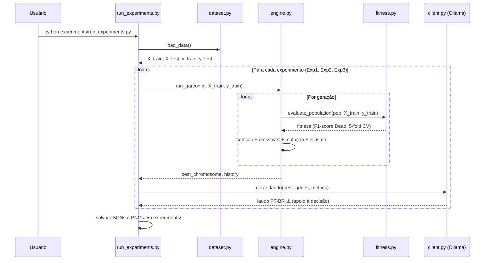

# Arquitetura da Solução

**Tech Challenge Fase 2 – PosTech IA para Devs**  
**Projeto 1:** Otimização de Regressão Logística via Algoritmo Genético + LLM (Ollama qwen3:8b)

---

## Visão Geral

O sistema implementa um pipeline de otimização de hiperparâmetros para Regressão Logística aplicada ao dataset Breast Cancer. O fluxo combina:

1. **Módulo de dados** – carregamento, limpeza e pré-processamento do CSV
2. **Módulo de modelos** – baseline com 3 classificadores (LR, RF, XGBoost)
3. **Algoritmo Genético** – otimização da Regressão Logística via evolução computacional
4. **Integração LLM** – interpretação dos resultados via Ollama qwen3:8b (local)
5. **Monitoramento** – logging estruturado com Loguru

---

## Diagrama de Fluxo de Dados



---

## Diagrama de Componentes



---

## Descrição Detalhada dos Componentes

### `src/models/dataset.py`
Responsável pelo carregamento e pré-processamento do dataset.

- Lê `data/Breast_Cancer.csv` via Pandas
- Trata a coluna `'T Stage '` (com espaço trailing no CSV original)
- Constrói o preprocessador sklearn: `StandardScaler` para numéricas, `OneHotEncoder` para categóricas
- Expõe `load_data()` e `build_preprocessor()` para uso no pipeline

### `src/models/train.py`
Treina os 3 modelos do Módulo 1 (baseline):

| Modelo | Resultado (teste) |
|--------|------------------|
| Regressão Logística | F1=0.3773, ROC-AUC=0.7185, Recall=0.5935 |
| Random Forest | F1=0.2857, ROC-AUC=0.6966, Recall=0.2276 |
| XGBoost | F1=0.3456, ROC-AUC=0.6821, Recall=0.3821 |

A LR foi escolhida para otimização por apresentar o melhor F1 Dead e ROC-AUC.

### `src/ga/chromosome.py`
Define a estrutura genética dos indivíduos.

- **Cromossomo:** dicionário de hiperparâmetros (`C`, `penalty`, `solver`, `max_iter`, `tol`)
- **Espaço de busca:** 10 valores para `C`, 2 penalidades, 3 solvers, 4 valores de `max_iter`, 3 de `tol`
- Restrição de compatibilidade `penalty × solver` garantida pela função `_fix_solver()`
- `initialize_population(pop_size, seed)` cria a população inicial reprodutível

### `src/ga/operators.py`
Operadores evolutivos:

- **Seleção por torneio** (`tournament_selection`): k candidatos aleatórios, o de maior fitness vence
- **Crossover uniforme** (`uniform_crossover`): cada gene herdado independentemente de um dos pais (p=0.5)
- **Mutação por substituição** (`mutate`): gene substituído por valor aleatório do espaço de busca com taxa `mutation_rate`
- **Elitismo** (`elitism`): os N melhores indivíduos são copiados diretamente para a próxima geração

### `src/ga/fitness.py`
Calcula o fitness de cada cromossomo:

- Constrói um `Pipeline` sklearn: preprocessador + `LogisticRegression(class_weight="balanced")`
- Avalia via `StratifiedKFold(n_splits=5)` com `scoring="f1"` (F1-score da classe Dead)
- Cache implícito: indivíduos já avaliados (`fitness >= 0`) não são reavaliados

### `src/ga/engine.py`
Loop evolutivo principal:

- Classe `GAConfig`: parametriza `pop_size`, `n_generations`, `crossover_rate`, `mutation_rate`, `tournament_size`, `elite_size`, `seed`
- Parada antecipada: sem melhora em **10 gerações consecutivas** (variação < 1e-5)
- Persiste resultados em `experiments/{experiment_name}_results.json`

### `src/llm/client.py`
Integração com Ollama qwen3:8b:

- Chama o modelo local via API HTTP do Ollama
- **Modo mock** ativado por variável de ambiente `LLM_MOCK=true` (retorna resposta fixa sem necessidade do Ollama em execução)
- Recebe os hiperparâmetros otimizados e métricas para compor o prompt

### `src/llm/prompts/diagnostico_pt.txt`
Prompt versionado separadamente do código:

- Instrui o modelo a gerar explicação clínica em PT-BR
- Inclui aviso explícito: **"apoio à decisão, NÃO substitui o julgamento do profissional de saúde"**
- Aceita variáveis interpoladas: `dados_paciente`, `predicao`, `probabilidade_dead`, `probabilidade_alive`, `f1_dead`, `roc_auc`, `recall_dead`

### `src/monitoring/logger.py`
Logging estruturado com Loguru:

- Saída em arquivo rotativo: `logs/app_YYYY-MM-DD.log`
- Saída em console (stderr)
- Níveis configurados via variável de ambiente

### `experiments/run_experiments.py`
Script principal que executa os 3 experimentos com configurações distintas e gera:

- JSON de resultados por experimento
- `comparativo_final.json` com todos os resultados
- Gráficos de convergência (`.png`)

---

## Fluxo de Execução



---

## Decisões de Infraestrutura

### Execução Local (sem nuvem)
Todo o pipeline roda localmente:
- **Ollama** roda na máquina do usuário, sem envio de dados para APIs externas
- Dados clínicos nunca saem do ambiente local
- Sem custo de API de LLM

### Gerenciamento de Dependências
Pip direto com `requirements.txt` gerado a partir do `pyproject.toml` (Poetry não disponível no sistema de CI). Ver [docs/decisoes.md](decisoes.md) – Decisão 9.

### Reprodutibilidade
- Seed fixo (`seed=42`) em todas as operações aleatórias do AG
- `StratifiedKFold(random_state=42)` no cálculo do fitness
- JSON de resultados persiste configuração completa + histórico geração a geração

### Testes
- 34 testes automatizados em `tests/`
- Modo mock da LLM (`LLM_MOCK=true`) elimina dependência do Ollama nos testes
- Cobertura rastreada com `pytest-cov`

---

## Estrutura de Diretórios

```
fiap-id-tech-challenge2/
├── data/
│   └── Breast_Cancer.csv          # Dataset original (4024 amostras, 16 colunas)
├── src/
│   ├── models/
│   │   ├── dataset.py             # Carregamento e pré-processamento
│   │   └── train.py               # Treinamento baseline (LR, RF, XGBoost)
│   ├── ga/
│   │   ├── chromosome.py          # Cromossomo e espaço de busca
│   │   ├── operators.py           # Seleção, crossover, mutação, elitismo
│   │   ├── fitness.py             # Função fitness (F1 Dead, 5-fold CV)
│   │   └── engine.py              # Loop evolutivo com parada antecipada
│   ├── llm/
│   │   ├── client.py              # Integração Ollama + modo mock
│   │   └── prompts/
│   │       └── diagnostico_pt.txt # Prompt versionado em PT-BR
│   └── monitoring/
│       └── logger.py              # Logging com Loguru
├── experiments/
│   ├── run_experiments.py         # Script dos 3 experimentos
│   ├── baseline_metrics.json
│   ├── exp1_baseline_ag_results.json
│   ├── exp2_alta_mutacao_results.json
│   ├── exp3_populacao_grande_results.json
│   ├── comparativo_final.json
│   └── *.png                      # Curvas de convergência
├── tests/                         # 34 testes automatizados
├── docs/
│   ├── arquitetura.md             # Este arquivo
│   ├── decisoes.md                # Registro de decisões
│   └── relatorio_tecnico.md       # Relatório técnico completo
├── logs/                          # Logs gerados em runtime
├── pyproject.toml                 # Metadados e dependências
└── README.md
```
