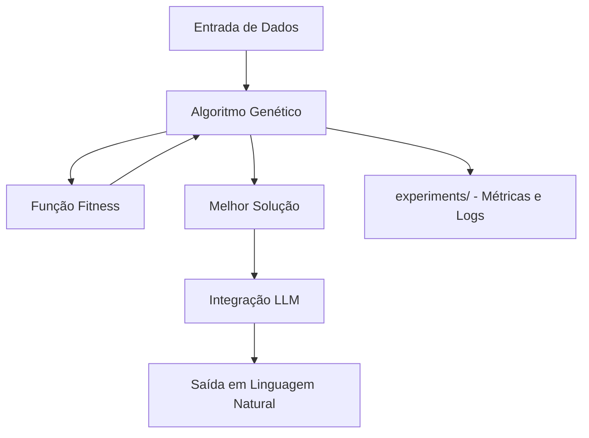

# Arquitetura da Solução

> Este documento descreve a arquitetura do sistema, incluindo componentes, fluxos de dados e diagramas.  
> Será atualizado à medida que o projeto for implementado.

---

## Visão Geral

*(A preencher após a definição do projeto escolhido.)*

---

## Componentes Principais

| Componente | Módulo | Responsabilidade |
|-----------|--------|-----------------|
| Algoritmo Genético | `src/ga/` | Otimização via evolução computacional |
| Integração LLM | `src/llm/` | Geração de linguagem natural via modelo pré-treinado |
| Monitoramento | `src/monitoring/` | Logging estruturado e rastreamento de métricas |
| API | `src/api/` | Exposição de endpoints (se aplicável) |

---

## Diagrama de Arquitetura

*(Será adicionado com sintaxe Mermaid.)*

---

## Fluxo de Dados

*(A preencher.)*

---

## Decisões de Infraestrutura

*(A preencher – nuvem é opcional.)*
