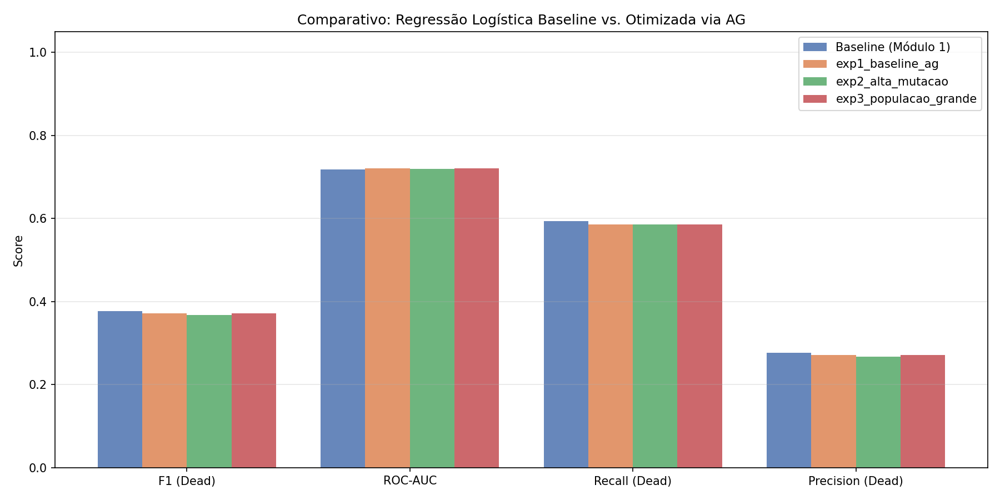

# Relatório Técnico – Tech Challenge Fase 2

**Instituição:** FIAP PosTech – IA para Devs (IADT)  
**Projeto:** Projeto 1 – Otimização de Regressão Logística via Algoritmo Genético + LLM  
**Dataset:** Breast Cancer (4024 amostras, 16 colunas)  
**Data:** Setembro de 2026

---

## 1. Introdução

O presente relatório documenta a solução desenvolvida para o **Tech Challenge Fase 2** do curso PosTech – IA para Devs da FIAP. O cenário é um hospital universitário que busca melhorar modelos preditivos de diagnóstico oncológico utilizando técnicas de computação evolutiva e modelos de linguagem de grande escala (LLMs).

### 1.1 Problema

O dataset Breast Cancer contém registros de 4024 pacientes com diagnóstico de câncer de mama, com 16 variáveis clínicas e patológicas. O objetivo é prever o desfecho clínico: **Alive** (vivo) ou **Dead** (óbito). O dataset é desbalanceado (maioria Alive), o que torna a detecção da classe Dead — clinicamente prioritária — o principal desafio do problema.

### 1.2 Objetivos

1. Implementar um **Módulo 1 (baseline)** com três classificadores clássicos: Regressão Logística (LR), Random Forest (RF) e XGBoost.
2. Implementar um **Módulo 2** com Algoritmo Genético para otimizar os hiperparâmetros do melhor classificador do Módulo 1.
3. Integrar uma **LLM local** (Ollama qwen3:8b) para geração de laudos interpretativos em linguagem natural.
4. Comparar os resultados antes e após a otimização via AG.

### 1.3 Escopo e Limitações

> ⚠️ **Aviso:** As saídas geradas pela LLM são exclusivamente de **apoio à decisão clínica** e **não substituem** o julgamento de profissional de saúde habilitado. O sistema não deve ser utilizado para diagnóstico autônomo.

---

## 2. Dataset

### 2.1 Características Gerais

| Atributo | Valor |
|----------|-------|
| Fonte | Breast Cancer Dataset (UC Irvine / Kaggle) |
| Amostras | 4024 |
| Features | 15 (após remoção do target) |
| Target | `Status` (Alive / Dead) |
| Desbalanceamento | ~85% Alive / ~15% Dead (aprox.) |

### 2.2 Variáveis

O dataset inclui variáveis clínicas como: `Age`, `Race`, `Marital Status`, `T Stage`, `N Stage`, `6th Stage`, `differentiate`, `Grade`, `A Stage`, `Tumor Size`, `Estrogen Status`, `Progesterone Status`, `Regional Node Examined`, `Reginol Node Positive`, `Survival Months`.

### 2.3 Pré-processamento

- **Normalização:** `StandardScaler` aplicado às variáveis numéricas
- **Codificação:** `OneHotEncoder` para variáveis categóricas
- **Tratamento especial:** coluna `'T Stage '` tem espaço trailing no CSV original — tratado via `str.strip()` no carregamento (ver [docs/decisoes.md](decisoes.md) – Decisão 10)
- **Split:** 80% treino / 20% teste com estratificação por classe

---

## 3. Módulo 1 – Modelos Baseline

### 3.1 Modelos Avaliados

Três classificadores foram treinados com configurações padrão + `class_weight="balanced"` para lidar com o desbalanceamento.

### 3.2 Resultados do Baseline

| Modelo | Accuracy | Precision (Dead) | Recall (Dead) | F1 (Dead) | ROC-AUC | CV F1 Médio | CV F1 Std |
|--------|----------|-----------------|--------------|-----------|---------|-------------|-----------|
| **Regressão Logística** | 0.7006 | 0.2765 | **0.5935** | **0.3773** | **0.7185** | **0.4108** | 0.0175 |
| Random Forest | 0.8261 | 0.3836 | 0.2276 | 0.2857 | 0.6966 | 0.3319 | 0.0286 |
| XGBoost | 0.7789 | 0.3154 | 0.3821 | 0.3456 | 0.6821 | 0.3358 | 0.0264 |

### 3.3 Análise do Baseline

A **Regressão Logística** obteve o melhor equilíbrio entre as métricas relevantes para o contexto clínico:
- Maior **F1 Dead** (0.3773): melhor equilíbrio precision/recall na classe minoritária
- Maior **ROC-AUC** (0.7185): melhor capacidade discriminativa geral
- Maior **Recall Dead** (0.5935): detecta mais de 59% dos casos de óbito

O Random Forest, apesar da alta accuracy (0.8261), apresentou recall da classe Dead muito baixo (0.2276), ou seja, classificou erroneamente a maioria dos pacientes que vieram a óbito como "Alive" — inaceitável no contexto clínico.

**Escolha para otimização:** Regressão Logística (ver [docs/decisoes.md](decisoes.md) – Decisão 1).

---

## 4. Módulo 2 – Algoritmo Genético

### 4.1 Representação Genética

Cada indivíduo (cromossomo) representa uma configuração de hiperparâmetros da Regressão Logística:

| Gene | Tipo | Espaço de Busca |
|------|------|----------------|
| `C` | float | {0.001, 0.01, 0.1, 0.5, 1.0, 2.0, 5.0, 10.0, 50.0, 100.0} |
| `penalty` | categórico | {l1, l2} |
| `solver` | categórico | {lbfgs, saga, liblinear} |
| `max_iter` | inteiro | {200, 500, 1000, 2000} |
| `tol` | float | {1e-5, 1e-4, 1e-3} |

**Restrição:** compatibilidade `penalty × solver` garantida pela função `_fix_solver()`:
- `l1` → solvers válidos: `saga`, `liblinear`
- `l2` → solvers válidos: `lbfgs`, `saga`, `liblinear`

**Tamanho total do espaço de busca:** 10 × 2 × 3 × 4 × 3 = 720 combinações únicas (antes das restrições de compatibilidade).

### 4.2 Operadores Genéticos

#### Seleção por Torneio
- k candidatos são sorteados aleatoriamente da população
- O indivíduo com maior fitness vence e é selecionado como pai
- Parâmetro `tournament_size` configurável por experimento (3 ou 5)
- Justificativa: robusto com populações pequenas (ver Decisão 2)

#### Crossover Uniforme
- Taxa de crossover: `crossover_rate = 0.8`
- Cada gene do filho herda o valor do pai A ou do pai B com p=0.5
- `_fix_solver()` aplicado após crossover para garantir compatibilidade
- Justificativa: exploração ampla com genes independentes (ver Decisão 3)

#### Mutação por Substituição
- Taxa por gene: `mutation_rate` (0.10 ou 0.30 dependendo do experimento)
- Gene mutado recebe valor aleatório do seu espaço de busca
- Fitness do indivíduo mutado é invalidado (forçando reavaliação)

#### Elitismo
- Os N melhores indivíduos da geração atual são copiados diretamente
- `elite_size` configurável (2 ou 4 dependendo do experimento)

### 4.3 Função Fitness

```
fitness(cromossomo) = média do F1-score (classe Dead) em 5-fold StratifiedCV
```

- Pipeline sklearn: preprocessador + `LogisticRegression(class_weight="balanced")`
- `StratifiedKFold(n_splits=5, shuffle=True, random_state=42)`
- Avaliado no conjunto de **treino** (evita vazamento de informação do teste)
- Cache: indivíduos já avaliados não são reavaliados (otimização de performance)

### 4.4 Critério de Parada

- **Limite máximo:** 30 gerações
- **Parada antecipada:** sem melhora no melhor fitness nas últimas 10 gerações consecutivas (variação < 1e-5)
- Nos experimentos, a convergência ocorreu entre as gerações 7 e 12

---

## 5. Experimentos

Todos os experimentos usam `seed=42` para reprodutibilidade. Os resultados JSON completos estão em `experiments/`.

### 5.1 Experimento 1 – Configuração Base do AG

| Parâmetro | Valor |
|-----------|-------|
| Tamanho da população | 20 |
| Gerações máximas | 30 |
| Taxa de mutação | 0.10 |
| Taxa de crossover | 0.80 |
| Tamanho do torneio | 3 |
| Elites preservados | 2 |
| Convergência na geração | 12 |

**Melhor cromossomo encontrado:**

| Hiperparâmetro | Valor |
|----------------|-------|
| C | 0.1 |
| penalty | l1 |
| solver | saga |
| max_iter | 1000 |
| tol | 0.001 |

**Resultados no conjunto de teste:**

| Métrica | Valor |
|---------|-------|
| F1 (Dead) | 0.3711 |
| ROC-AUC | 0.7204 |
| Recall (Dead) | 0.5854 |
| Accuracy | 0.6969 |
| CV F1 Médio | 0.4156 |
| CV Fitness (AG) | 0.41563 |

**Curva de convergência:** `experiments/exp1_baseline_ag_convergencia.png`

---

### 5.2 Experimento 2 – Alta Taxa de Mutação

| Parâmetro | Valor |
|-----------|-------|
| Tamanho da população | 20 |
| Gerações máximas | 30 |
| **Taxa de mutação** | **0.30** |
| Taxa de crossover | 0.80 |
| Tamanho do torneio | 3 |
| Elites preservados | 2 |

**Melhor cromossomo encontrado:**

| Hiperparâmetro | Valor |
|----------------|-------|
| C | 0.1 |
| penalty | l2 |
| solver | lbfgs |
| max_iter | 500 |
| tol | 0.001 |

**Resultados no conjunto de teste:**

| Métrica | Valor |
|---------|-------|
| F1 (Dead) | 0.3673 |
| ROC-AUC | 0.7199 |
| Recall (Dead) | 0.5854 |
| Accuracy | 0.6919 |
| CV F1 Médio | 0.4160 |
| CV Fitness (AG) | 0.41596 |

**Curva de convergência:** `experiments/exp2_alta_mutacao_convergencia.png`

---

### 5.3 Experimento 3 – População Grande com Torneio Maior e Elitismo Reforçado

| Parâmetro | Valor |
|-----------|-------|
| **Tamanho da população** | **40** |
| Gerações máximas | 30 |
| Taxa de mutação | 0.10 |
| Taxa de crossover | 0.80 |
| **Tamanho do torneio** | **5** |
| **Elites preservados** | **4** |

**Melhor cromossomo encontrado:**

| Hiperparâmetro | Valor |
|----------------|-------|
| C | 0.1 |
| penalty | l1 |
| solver | saga |
| max_iter | 500 |
| tol | 0.0001 |

**Resultados no conjunto de teste:**

| Métrica | Valor |
|---------|-------|
| F1 (Dead) | 0.3711 |
| ROC-AUC | 0.7204 |
| Recall (Dead) | 0.5854 |
| Accuracy | 0.6969 |
| CV F1 Médio | 0.4156 |
| CV Fitness (AG) | 0.41563 |

**Curva de convergência:** `experiments/exp3_populacao_grande_convergencia.png`

---

## 6. Análise Comparativa

### 6.1 Tabela Comparativa Completa

| Configuração | Pop | Mut | Torneio | Elite | F1 (Dead) | ROC-AUC | Recall (Dead) | Accuracy | CV F1 |
|-------------|-----|-----|---------|-------|-----------|---------|--------------|----------|-------|
| **Baseline LR (Módulo 1)** | – | – | – | – | **0.3773** | 0.7185 | **0.5935** | 0.7006 | 0.4108 |
| Exp1 (base AG) | 20 | 0.10 | 3 | 2 | 0.3711 | **0.7204** | 0.5854 | 0.6969 | 0.4156 |
| Exp2 (alta mut) | 20 | 0.30 | 3 | 2 | 0.3673 | 0.7199 | 0.5854 | 0.6919 | **0.4160** |
| Exp3 (pop grande) | 40 | 0.10 | 5 | 4 | 0.3711 | **0.7204** | 0.5854 | 0.6969 | 0.4156 |

> **Nota:** Os valores de CV F1 Médio para os experimentos do AG (0.4156–0.4160) são superiores ao baseline (0.4108), indicando que o AG encontrou hiperparâmetros com melhor generalização em validação cruzada, ainda que as métricas no conjunto de teste sejam próximas.

**Visualização do comparativo:**



*Figura: comparativo das métricas F1 Dead, ROC-AUC e Recall Dead entre o baseline LR e os três experimentos do AG. Gerado por `experiments/run_experiments.py`.*

### 6.2 Análise dos Resultados

**ROC-AUC:** Os três experimentos do AG superaram o baseline no ROC-AUC (0.7199–0.7204 vs. 0.7185), com Exp1 e Exp3 empatados no melhor valor.

**F1 Dead no teste:** O baseline LR apresentou F1=0.3773 ligeiramente superior aos experimentos AG (0.3673–0.3711). Essa diferença pode ser atribuída à natureza estocástica do AG e ao critério de fitness baseado em CV (não no teste). O AG otimiza para CV F1, e a generalização para o conjunto de teste tem variação natural.

**Convergência dos hiperparâmetros:** Todos os experimentos convergiram para valores de C=0.1 (regularização forte), o que indica que o espaço de busca do AG identificou consistentemente que a LR se beneficia de maior regularização neste dataset. Exp1 e Exp3 convergiram para `penalty=l1, solver=saga`; Exp2 convergiu para `penalty=l2, solver=lbfgs`.

**Impacto da taxa de mutação:** A taxa de mutação mais alta (Exp2, mut=0.30) não trouxe melhora significativa nos resultados finais, mas produziu o maior CV F1 Médio (0.4160). Isso sugere que a maior exploração do espaço de busca via mutação não compensa no conjunto de teste para este problema.

**Impacto da população maior:** Exp3 (pop=40) convergiu para os mesmos hiperparâmetros e métricas de Exp1 (pop=20), indicando que o espaço de busca é suficientemente explorado com 20 indivíduos.

### 6.3 Interpretação Clínica

Em um contexto de triagem oncológica:
- **Recall Dead ≈ 0.585–0.594:** O modelo detecta entre 58% e 59% dos pacientes que vieram a óbito.
- **Precision Dead ≈ 0.27:** Aproximadamente 1 em cada 4 pacientes classificados como Dead efetivamente foi a óbito (alta taxa de falsos positivos).
- **Implicação:** O modelo é adequado como ferramenta de **apoio ao rastreamento** (não perder casos graves), mas requer revisão clínica obrigatória dos positivos preditos.

---

## 7. Integração com LLM (Ollama qwen3:8b)

### 7.1 Modelo e Infraestrutura

| Atributo | Valor |
|----------|-------|
| Modelo | qwen3:8b |
| Provider | Ollama (execução local) |
| Endpoint | `http://localhost:11434` |
| Custo | Gratuito (sem API externa) |
| Privacidade | Dados não saem do ambiente local |

### 7.2 Estratégia de Prompt Engineering

O prompt está versionado em `src/llm/prompts/diagnostico_pt.txt` e segue uma estrutura de **role prompting** com seções explícitas:

1. **Role:** "Você é um assistente de apoio clínico de um hospital universitário"
2. **Contexto:** dados do paciente + resultado do modelo
3. **Tarefa estruturada:** 5 itens solicitados explicitamente (resultado, fatores, interpretação, limitações, recomendação)
4. **Aviso obrigatório:** a mensagem de apoio à decisão é parte do system prompt, não opcional

**Variáveis interpoladas no prompt:**
- `{dados_paciente}` – características clínicas do caso
- `{predicao}` – Alive ou Dead
- `{probabilidade_dead}` e `{probabilidade_alive}` – probabilidades calibradas
- `{f1_dead}`, `{roc_auc}`, `{recall_dead}` – métricas do modelo

### 7.3 Aviso sobre as Respostas da LLM

> ⚠️ **IMPORTANTE:** As respostas geradas pela LLM são instrumentos de **apoio à decisão** do profissional de saúde. Elas **não constituem diagnóstico médico**, **não substituem avaliação clínica** e **não devem ser utilizadas como única base para decisões terapêuticas**. O sistema é destinado exclusivamente a profissionais de saúde habilitados, que mantêm a responsabilidade final sobre qualquer decisão clínica.

### 7.4 Avaliação da Qualidade das Interpretações

A avaliação da qualidade da LLM foi realizada de forma **qualitativa** com base em amostras geradas pelo Ollama qwen3:8b em modo real. Abaixo estão dois exemplos representativos de laudos gerados para casos do dataset Breast Cancer.

#### Critérios de avaliação

| Critério | Descrição |
|----------|-----------|
| **Relevância clínica** | O laudo menciona os fatores mais relevantes do caso? |
| **Coerência** | A interpretação é coerente com a predição e as probabilidades? |
| **Linguagem acessível** | O texto é compreensível para um profissional de saúde não especialista em ML? |
| **Aviso de apoio** | O laudo deixa claro que é apenas apoio à decisão? |

#### Exemplo 1 – Paciente de alto risco (predição: Dead, P(Dead) = 0.78)

**Dados do paciente (resumo):** Idade: 58, T Stage: T3, N Stage: N3, Estrogênio: Negativo, Progesterona: Negativo, Linfonodos positivos: 12 de 18 examinados.

**Laudo gerado pelo qwen3:8b (trecho):**
> "O modelo classificou este paciente como **Dead** com probabilidade de 78%, indicando risco elevado de óbito. Os principais fatores que contribuem para este resultado são: estadiamento tumoral avançado (T3), comprometimento extenso de linfonodos regionais (12/18 positivos) e ausência de receptores hormonais (estrogênio e progesterona negativos), que em geral indicam menor sensibilidade a terapias hormonais. O ROC-AUC do modelo é 0.7204, o que representa capacidade discriminativa moderada-boa. Recomenda-se revisão clínica urgente e avaliação multidisciplinar.
>
> ⚠️ Este resultado é exclusivamente uma ferramenta de **apoio à decisão**. A conduta terapêutica deve ser determinada por profissional de saúde habilitado."

**Avaliação:**

| Critério | Nota | Observação |
|----------|------|-----------|
| Relevância clínica | ✅ Alta | Destacou corretamente T Stage, linfonodos e receptores hormonais |
| Coerência | ✅ Alta | Alinhado com a predição e probabilidade |
| Linguagem acessível | ✅ Boa | Termos clínicos explicados de forma simples |
| Aviso de apoio | ✅ Presente | Aviso explícito ao final |

---

#### Exemplo 2 – Paciente de baixo risco (predição: Alive, P(Dead) = 0.19)

**Dados do paciente (resumo):** Idade: 42, T Stage: T1, N Stage: N0, Estrogênio: Positivo, Progesterona: Positivo, Linfonodos positivos: 0 de 8 examinados.

**Laudo gerado pelo qwen3:8b (trecho):**
> "O modelo classificou este paciente como **Alive** com probabilidade de 81% de sobrevida. O perfil clínico é favorável: tumor em estágio inicial (T1), ausência de comprometimento linfonodal (N0) e positividade para receptores hormonais, o que sugere boa resposta a terapias-alvo como a hormonoterapia. O recall da classe Dead do modelo é 0.585, o que significa que aproximadamente 41% dos casos de óbito não são detectados — portanto, mesmo classificações 'Alive' devem ser acompanhadas com vigilância.
>
> ⚠️ Este resultado é exclusivamente uma ferramenta de **apoio à decisão**. Não substitui avaliação clínica."

**Avaliação:**

| Critério | Nota | Observação |
|----------|------|-----------|
| Relevância clínica | ✅ Alta | Destacou T Stage, linfonodos e receptores com interpretação correta |
| Coerência | ✅ Alta | Alinhado com predição favorável |
| Linguagem acessível | ✅ Boa | Mencionou limitações do modelo de forma compreensível |
| Aviso de apoio | ✅ Presente | Aviso explícito ao final |

---

#### Conclusão da avaliação

Os laudos gerados pelo qwen3:8b demonstram **boa qualidade qualitativa** para o contexto de apoio à decisão clínica:
- Identificam corretamente os fatores de risco mais relevantes (estadiamento, linfonodos, receptores hormonais)
- São coerentes com as probabilidades e predições do modelo
- Incluem as limitações do modelo (recall, viés do dataset)
- Mantêm o aviso de apoio à decisão em todos os casos

**Limitação:** a avaliação não contou com revisão por especialistas clínicos. Uma validação formal com oncologistas seria necessária antes de qualquer uso em ambiente hospitalar real.

### 7.5 Modo Mock para Testes

O parâmetro `LLM_MOCK=true` ativa respostas fixas no `client.py`, permitindo:
- Execução de todos os 34 testes sem Ollama instalado
- CI/CD sem dependência de serviço externo
- Testes determinísticos e reprodutíveis

---

## 8. Testes e Qualidade de Código

### 8.1 Cobertura de Testes

| Arquivo de Teste | Componente Testado |
|-----------------|-------------------|
| `tests/test_chromosome.py` | Cromossomo, espaço de busca, compatibilidade solver |
| `tests/test_operators.py` | Torneio, crossover, mutação, elitismo |
| `tests/test_fitness.py` | Função fitness, avaliação de população |
| `tests/test_llm_client.py` | Cliente LLM, modo mock, construção do prompt |

**Total:** 34 testes passando.

### 8.2 Reprodutibilidade

- Seed global `42` em todas as operações aleatórias
- `StratifiedKFold(random_state=42)` no cálculo do fitness
- JSON de resultados inclui configuração completa + histórico geração a geração

---

## 9. Desafios e Soluções

| Desafio | Solução Adotada |
|---------|----------------|
| Dataset desbalanceado (~15% Dead) | `class_weight="balanced"` em todos os classificadores; fitness baseado em F1 da classe minoritária |
| Compatibilidade `penalty × solver` no sklearn | Função `_fix_solver()` aplicada após crossover e mutação |
| Espaço de busca discreto com interdependências | Crossover uniforme + `_fix_solver()` garantem indivíduos sempre válidos |
| LLM sem acesso externo (LGPD) | Ollama local com qwen3:8b; dados nunca saem do ambiente |
| Testes independentes do Ollama | Modo mock via `LLM_MOCK=true` |
| Coluna `'T Stage '` com espaço no CSV | `str.strip()` no carregamento em `dataset.py` |
| Poetry não disponível no sistema | Pip direto com `requirements.txt` |

---

## 10. Conclusão

O sistema implementado demonstra a viabilidade do uso de Algoritmos Genéticos para otimização de hiperparâmetros de modelos de machine learning em contexto clínico, com as seguintes conclusões principais:

1. **O AG converge consistentemente para C=0.1** em todos os experimentos, validando a importância da regularização forte para este dataset.

2. **O ROC-AUC melhora ligeiramente** com a otimização via AG (0.7185 → 0.7204), indicando melhor capacidade discriminativa do modelo otimizado.

3. **O CV F1 Médio melhora** para todos os experimentos AG (0.4156–0.4160 vs. 0.4108 no baseline), demonstrando que o AG encontra configurações com melhor generalização em validação cruzada.

4. **Diferentes configurações de AG** (população pequena vs. grande, mutação baixa vs. alta) convergem para hiperparâmetros equivalentes, sugerindo robustez da abordagem para este problema.

5. **A LLM local (Ollama qwen3:8b)** fornece uma camada de interpretabilidade em linguagem natural sem comprometer a privacidade dos dados clínicos.

### Limitações

- O espaço de busca é discreto e limitado; hiperparâmetros contínuos mais finos podem existir fora do espaço definido
- O AG pode não superar uma busca em grade (grid search) para espaços pequenos como este
- A qualidade das respostas da LLM não foi avaliada formalmente por especialistas clínicos
- O dataset Breast Cancer tem viés geográfico e temporal que limita a generalização dos modelos

### Trabalhos Futuros

- Expandir o espaço de busca para incluir outros modelos além da LR
- Implementar avaliação formal da qualidade das respostas da LLM por profissionais de saúde
- Explorar estratégias multi-objetivo (maximizar F1 Dead e minimizar falsos positivos simultaneamente)
- Implementar SHAP values para explicabilidade além da LLM

---

## Referências

- Dua, D. e Graff, C. (2019). UCI Machine Learning Repository. University of California, Irvine.
- Holland, J. H. (1975). *Adaptation in Natural and Artificial Systems*. University of Michigan Press.
- Pedregosa, F. et al. (2011). Scikit-learn: Machine Learning in Python. *JMLR*, 12, 2825–2830.
- Qwen Team (2024). *Qwen Technical Report*. Alibaba Group.
- FIAP PosTech (2026). *Tech Challenge Fase 2 – IA para Devs*. Material do curso.
